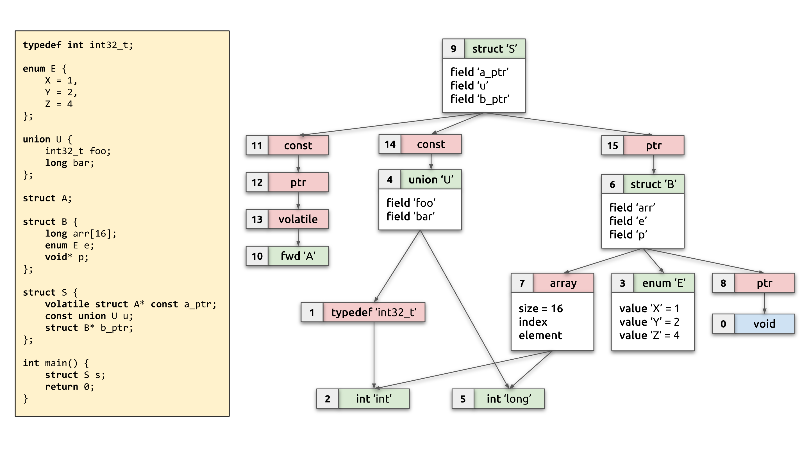
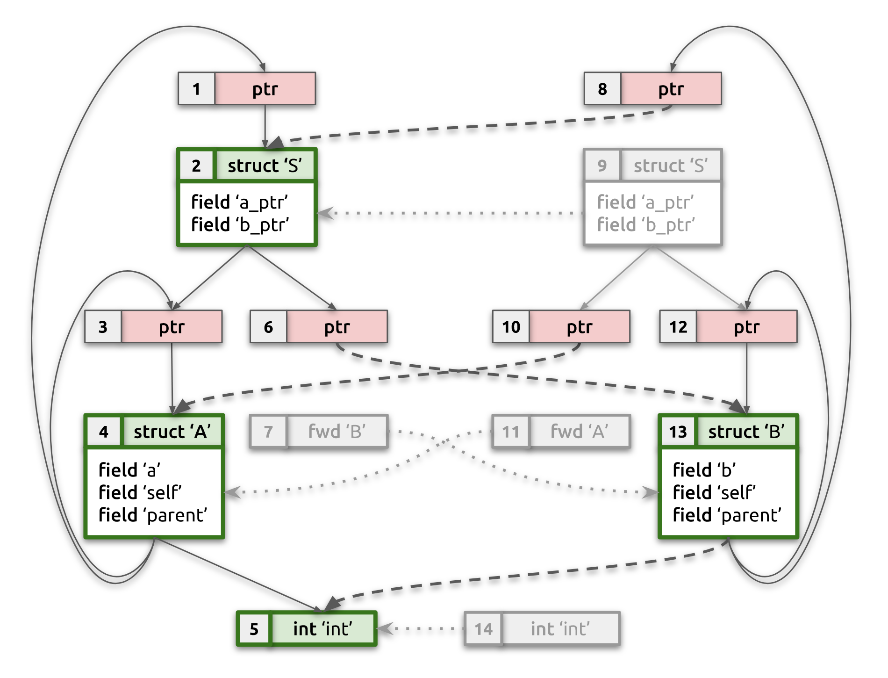
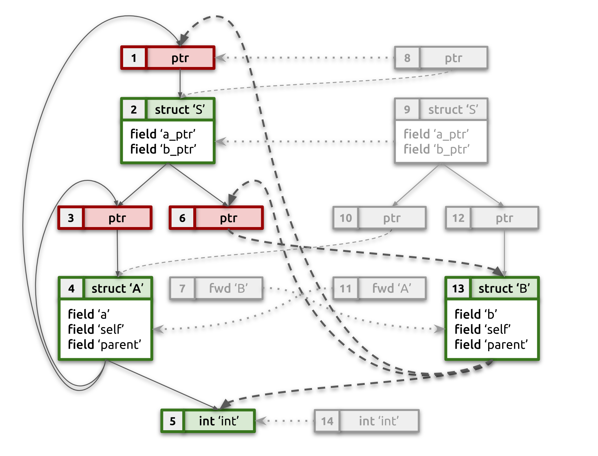
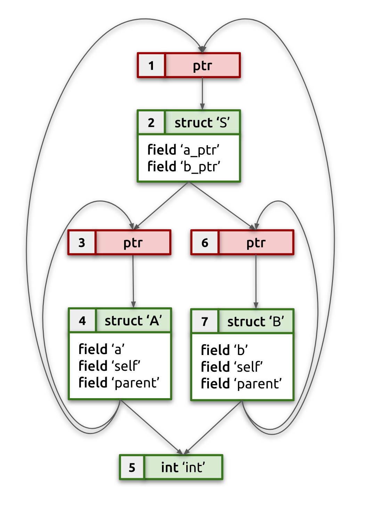

+++
title = "BTF deduplication and Linux kernel BTF"
date = 2018-11-14

[extra]
toc = true

[taxonomies]
categories = ["BPF"]
tags = ["btf", "algorithms"]
+++

*This is a slightly updated (in 2020) version of [the
post](https://facebookmicrosites.github.io/bpf/blog/2018/11/14/btf-enhancement.html)
first published at Facebook's [BPF
blog](https://facebookmicrosites.github.io/bpf/blog/) back in 2018. BTF
deduplication is what got me started with BPF and Linux kernel development, so
I'm re-publishing it here retroactively for a more complete story of my
involvement with BPF. Please also check out updated ["What's next
section"](#what-s-next) for a short summary on what happened in BPF world after
BTF dedup was developed.*

<!-- more -->

[BTF](https://www.kernel.org/doc/html/latest/bpf/btf.html) (BPF Type Format)
is a compact format for representing type information. Modern
[BPF](https://lwn.net/Articles/740157/) technology relies heavily on BTF
to enable fascinating new features and to take BPF developer experience to the
next level. This post describes BTF deduplication algorithm, developed back in
2018, which allowed to scompress **124MB** of DWARF type data into just
a **1.5MB** of compact BTF data. This made it possible for Linux kernel to
always run with its own BTF type information included, opening up a lot of new
functionality since then and will no doubt allow to do even more going
forward.

# BPF and type information

[BPF](https://lwn.net/Articles/740157/) is a technology that allows
unprecedented ability to execute custom external code **safely** inside the
Linux kernel in response to various events (hooks). This enables all kinds of
applications that are either impossible or expensive to achieve by other means
(e.g., low-overhead profiling and tracing, rich kernel introspection, fast and
custom network packets processing, etc).

While the BPF technology is already very capable and is constantly being
developed further, the current developer experience with it is not exactly
a walk in the park yet. One way to smooth out the developer experience with
BPF is through better introspection and debuggability of BPF code. To allow
that BPF needs to know a bunch of metadata information about the BPF program.
Type information is one of a few critical pieces of metadata necessary to
bring the BPF experience to the next level. Eventually, this metadata will
enable not just introspection, but also much higher levels of re-usability of
BPF code across different versions of the Linux kernel (the so-called "compile
once, run everywhere" approach, [BPF CO-RE](/posts/bpf-portability-and-co-re/)).

How is such metadata represented in user-space (non-BPF) programs? It's
typically done through
[DWARF](http://www.dwarfstd.org/doc/Debugging%20using%20DWARF.pdf) debug
information. The problem with DWARF though, is that it's very generic and
expressive, which makes it quite a complicated and verbose format, and thus
unsuitable to include in the Linux kernel image due to the size overhead and
the complexity of parsing it.

Enter BTF ([BPF Type
Format](https://www.mail-archive.com/netdev@vger.kernel.org/msg226733.html)).
It's a minimalistic, compact format, inspired by Sun's CTF (Compact C Type
Format), which is used for representing kernel debug information since Solaris
9. BTF was created for similar purposes with a focus on simplicity and
compactness to allow its usage in the Linux kernel and BPF. 

We won't describe BTF in a lot of detail here, please check [kernel BTF
documentation](https://www.kernel.org/doc/html/latest/bpf/btf.html) for a more
complete information. Suffice it to say that BTF represents each type with one
of a few possible type descriptors identified by a *kind*: `BTF_KIND_INT`,
`BTF_KIND_ENUM`, `BTF_KIND_STRUCT`, `BTF_KIND_UNION`, `BTF_KIND_ARRAY`,
`BTF_KIND_FWD`, `BTF_KIND_PTR`, `BTF_KIND_CONST`, `BTF_KIND_VOLATILE`,
`BTF_KIND_RESTRICT`, `BTF_KIND_TYPEDEF` — a few more might be added soon for
functions support, etc. Depending on the kind, there might be additional
variable-sized information available. Some kinds of types can reference other
types using their type IDs (e.g., `int *` type is two type descriptors: `PTR`
→ `INT`). The type descriptor's ID is its position in the input array of all
descriptors. BTF type information is stored in `.BTF` ELF section, which
contains two parts: BTF type data, followed by `\0`-separated strings section. 



The diagram above should give a pretty good idea of the BTF type graph. It
shows some C source code on the left and its corresponding BTF type graph on
the right. The type with ID 0 is special, it represents `void` and is
implicit: the first type descriptor in the `.BTF` section has type ID 1. In
all the diagrams  in this blog post, type IDs are written out in the top-left
corner of each type node. Type references are marked with arrows. For
structs/unions it should be obvious from the diagrams which field references
which type. Note that type nodes are shown in two different colors: green for
non-reference types, and red for reference ones (this distinction will be
explained further below).

A well-known (at least within the kernel community) tool,
[pahole](https://lwn.net/Articles/335942/), was recently updated with the
ability to convert DWARF into corresponding BTF type information in
a straightforward, one-to-one fashion. It iterates over each DWARF type
descriptor, converts it trivially into a BTF type descriptor and embeds all of
them into the `.BTF` section in the ELF binary. Simple and easy. We're done,
right? Unfortunately, no. 

The problem is that DWARF information is emitted by the compiler for each
compilation unit (CU) (e.g., in the C/C++ world CI corresponds to a single
compiled `.c`/`.cpp` file) independently and in isolation from other CUs that
form the resulting binary. This means that DWARF information within a single
CU has to describe all types referenced directly and indirectly (e.g., through
struct fields) by code within that CU, down to primitive types like `int` and
`long`.  DWARF data from all CUs is then concatenated by the linker and put
into the resulting binary `.debug_info` (and a few other) ELF sections. As you
can imagine, this results in a great duplication of type information. For
instance, for the kernel image on my machine, DWARF type data (`.debug_info`
section) takes 121.31MB and strings (`.debug_str` section) take another
2.68MB. After pahole's DWARF-to-BTF conversion there are 3.15 million BTF
type descriptors: BTF type data takes 101.7MB, and strings take an additional
3.03MB. Not exactly a small amount of information to embed into the Linux
kernel.

There are still other problems though. The same type hierarchy (e.g., a struct
and all the types that struct references) can be represented in DWARF/BTF to
various degrees of completeness (or, rather, *incompleteness*) due to
forward declarations.

Let's take a look at an example, that we'll use throughout this post to better
understand the problem and the solution. Let's suppose we have two compilation
units (CUs), each using same `struct S`, but each of them having incomplete
type information about struct's fields:

```c
/* CU #1: */

struct S;

struct A {
	int a;
	struct A* self;
	struct S* parent;
};

struct B;

struct S {
	struct A* a_ptr;
	struct B* b_ptr;
};


/* CU #2: */

struct S;

struct A;

struct B {
	int b;
	struct B* self;
	struct S* parent;
};

struct S {
	struct A* a_ptr;
	struct B* b_ptr;
};
```

In the case of CU #1, DWARF (and, subsequently, BTF) data will only show that
`struct B` exists (and no further details about it), but will have a complete
type information about `struct A`. While for CU #2, it will have the full type
information about `struct B`, but will only contain a forward declaration of
`struct A` (in BTF terms, it will have `BTF_KIND_FWD` type descriptor with
name `B`).

This compilation unit isolation means that it's possible there is no single CU
with complete type information describing structs `S`, `A`, and `B` fully.
Also, we might get tons of duplicated and redundant type information.
Unfortunately, for BPF use cases that are going to rely on BTF data, it's
important to have a single and complete type information per each unique type,
without any duplicates and incompleteness. 

That means we need to have an algorithm, that would take this duplicated and
potentially incomplete BTF information and emit clean and compact deduplicated
type information, while also "reconstructing" complete type information by
merging pieces of it from different CUs. Such BTF data can then be embedded
into the Linux kernel image and readily utilized by both the kernel itself
(e.g., by BPF verifier for more advanced verification scenarios), as well as
external tooling to allow types introspection and better debugging
capabilities.

Additional complications we need to keep in mind come from the fact that
types, in general, can form graphs containing cycles, not just DAGs. The
example above has few type cycles, which we'll use as an opportunity to better
demonstrate in subsequent sections how the algorithm works. Type cycles are
very common in real programs: they're typical for linked list nodes, but any
moderately complex program probably would form much more complicated cycles.
The Linux kernel's `struct task_struct`, for instance, is part of a pretty big
connected type graph with multiple cycles! 

So, in summary, we need an algorithm that will:
- deduplicate redundant BTF information and leave single instance of each
  unique type;
- merge and reconstruct complete type information from forward declarations
  across multiple CUs;
- handle type cycles correctly and efficiently;
- do all of the above fast and reliably to become a part of Linux kernel build
  process.

This post describes just such a BTF deduplication algorithm (or "BTF dedup",
for short).

# Algorithm

The BTF dedup algorithm takes as an input an in-memory blob representing
`.BTF` ELF section with all BTF type descriptors and string data, that comes
separately from descriptors. It overwrites that memory in-place with
deduplicated types and strings without any loss of information.

While the algorithm does deduplication it also merges and resolves type
information, whenever possible. For instance, in the example above with two
compilation units having partial type information for structs `A` and `B`, the
output of the algorithm will emit a single copy of each BTF type that
describes structs `A`, `B`, and `S` (as well as type information for `int` and
pointers), as if they were defined in a single compilation unit (see the
diagram below for a visual representation of input and expected output BTF
type graphs):

```c
struct A {
	int a;
	struct A* self;
	struct S* parent;
};

struct B {
	int b;
	struct B* self;
	struct S* parent;
};

struct S {
	struct A* a_ptr;
	struct B* b_ptr;
};
```


## Algorithm summary

The algorithm completes its work in five separate passes, which we'll describe
briefly here and in detail in subsequent sections:

1. **Strings deduplication:** Deduplicate string data, re-write all string
   offsets within BTF type descriptors to simplify string comparisons later.
2. **Non-reference types deduplication:** Establish equivalence between and
   deduplicate integer, enum, struct, union and forward types.
3. **Reference types deduplication:** Deduplicate pointers,
   const/volatile/restrict modifiers, typedefs, and array.
4. **Type compaction:** Compact type descriptors leaving only unique ones.
5. **Type IDs fix up:** Update all referenced type IDs with new ones
   established during compaction.

There are also a few important ideas and data structures the algorithm relies
on, which are critical to understanding it and would be useful to keep in mind
as you follow along.

1. **String deduplication as a very first step**. BTF doesn't embed strings
   into type descriptors. Instead, all the strings are concatenated into
   a byte array of string data with `\0` as a separator. Strings themselves
   are referenced from type descriptors using offsets into this array
   (typically through `name_off` fields). By performing string deduplication
   early, we can avoid comparing string contents later: after string
   deduplication it's enough to just compare corresponding string offsets to
   determine string equality, which both saves time and simplifies code.

2. Using a side array to store **type equivalence mapping** for duplicated and
   resolved BTF types, instead of modifying IDs in-place. As the algorithm
   performs deduplication and type info merging, it needs to transform the
   type graph to record type equivalence and resolve forward declarations to
   struct/union type descriptors. By utilizing a separate array to store this
   mapping (instead of updating referenced type IDs in-place inside each
   affected BTF type descriptor), we are performing graph transformations that
   would potentially need `O(N)` type ID rewrites (if done in-place) with just
   a single value update in this array. This is a crucial idea to allow simple
   and efficient `BTF_KIND_FWD` → `BTF_KIND_{STRUCT|UNION}` remapping. The
   small price to pay for this is the need to consult this array for every
   type ID resolution when trying to get BTF type descriptor by type ID.

3. **Canonical types.** The algorithm determines the canonical type descriptor
   ("one and only representative") for each unique type. This canonical type
   is the one that will go into the final deduplicated BTF type information.
   For struct/unions, it is also the type that the algorithm will merge
   additional type information into, as it discovers it from data in other
   CUs. To facilitate fast discovery of canonical types, we also maintain
   a canonical index, which maps the type descriptor's signature (i.e., kind,
   name, size, etc.) into a list of canonical types that match that signature.
   With sufficiently good choice of type signature (hash) function, we can
   limit the number of canonical types for each unique type signature to
   a very small number, allowing the discovery of canonical type for any
   duplicated type very quickly.

## Pass #1: strings deduplication

This step is pretty self-explanatory. Take a string section that follows BTF
type descriptors, do equivalent of `$ sort | uniq`, and remap all `name_off`
fields of type descriptors to point to corresponding deduplicated string.

To reiterate the key idea #1 above, the purpose of this step is twofold:
1. Eliminate duplicate strings to save space taken by the strings section.
2. Simplify and speed up string comparisons by reducing them to offset
   comparison. Instead of doing `strcmp()` of two strings, we now just need to
   compare corresponding `name_off` values.

Note that it's also possible to leave only strings, that are actually
referenced by BTF type descriptors. DWARF information is more generic than
BTF, so there might be strings in the DWARF string section that are referenced
from other kinds of DWARF data, which we don't care about. Currently pahole
blindly copies the DWARF strings section as is into the BTF string section
without doing any kind of filtering. By leaving only strings referenced from
actual BTF information, we can further save a little bit of space.

## Pass #2: non-reference types deduplication

BTF types can be divided into two broad categories of types:
1. *Reference types.* These are usually unnamed and their equivalence is
   determined solely by equivalence of the type they are referencing. For
   instance, two BTF `BTF_KIND_PTR`s are equivalent if and only if the types
   they are referencing are equivalent. Same for `BTF_KIND_CONST`,
   `BTF_KIND_VOLATILE`, `BTF_KIND_RESTRICT` and `BTF_KIND_TYPEDEF`.
   `BTF_KIND_ARRAY` is also considered a reference type because in addition to
   dimensionality info, array's index and element types determine equivalence
   of two arrays.
2. *Non-reference types.* Primitive types (`BTF_KIND_INT`) and enums
   (`BTF_KIND_ENUM`) are obvious cases of this, as their equivalence is
   determined purely by their structure (name, bit size, signedness, set of
   possible values, etc). Structs (`BTF_KIND_STRUCT`) and unions
   (`BTF_KIND_UNION`) are slightly less obvious ones, as they might reference
   other types (and even form type cycles, as mentioned before) and their
   equivalence is determined by equivalence of the entire connected type graph
   they form. Nevertheless, for the purposes of the BTF deduplication
   algorithm they are considered to be non-reference types and are processed
   in the same pass as primitive types and enums.

In pass #2 we go over all non-reference types and deduplicate them. Unlike
string deduplication, though, no data is yet re-written or copied around. For
each unique type we determine its canonical representative that all other
equivalent types would logically be replaced with in the output. This is done
by keeping track of the equivalence map from any type to its canonical type.
Also, the algorithm consults and updates the canonical index (key idea #3) to
keep track of potential canonical candidates for types with the same type
signature. 

For reference types, the equivalence map is not yet initialized and is
ignored, but for non-reference types it will point to either itself (when the
type is a canonical one) or an equivalent type. This mapping is used for
equivalence checks, and in later phases will determine which types should be
emitted into the final output set of BTF types: only the unique canonical type
will be preserved.

To quickly determine a potential canonical type, the algorithm maintains
a canonical index from the BTF type signature to a list of potential canonical
types. The type signature incorporates key distinguishing factors of a type:
name, kind, size, number and names of members (for enum, struct, and union).
All those are hashed together and the resulting number is used as a lookup key
into the canonical index. By choosing a good hashing function and a set of
distinguishing factors, we are significantly reducing the number of potential
candidates that need to be checked for complete equivalence, greatly speeding
up processing time. Any type with a different type signature won't be even
considered. The list of candidates will normally be either empty (if the type
hasn't been seen before) or will contain one candidate, though due to hash
collisions this can have a longer list of candidates.

Equivalence checks are performed differently according to the particular kind
of BTF type.

Two integer types are equivalent if and only if their name, bit size and
signedness matches. This way, 32-bit 'in' will be different from 32-bit
'unsigned int', for instance.

Two enum types are equivalent, if and only if their name, size and a set of
values and value names match exactly. 

Note that without loss of generality, and for the sake of brevity, I'll refer
to structs only, but all the same logic applies to unions and functions. When
functions are added to BTF, they can be treated as a struct, where the name of
a function corresponds to a struct name, arguments are fields, and return type
is just a special field of a struct.

Determining equivalence of two structs is a bit more involved though. Of
course, first and foremost, all the basic information (name, size, number and
names of fields) should match, but that is not sufficient for two structs to
be equivalent. It's necessary to check equivalence of entire type graphs that
are formed by types referenced from struct's fields, including all the further
indirectly referenced types. 

This is done by traversing these graphs with a DFS algorithm, keeping track of
a "hypothetical" equivalence mapping for types we've traversed so far. On one
side we have canonical struct (and its corresponding type graph), on the other
side, a candidate struct and type graph, that we're comparing against the
canonical one. Hypothetical mapping keeps track of which type in **candidate
type graph** is equivalent to in **canonical type graph**. This allows to
avoid cycles (by skipping equivalence checks for types we already compared)
and detect conflicts (contradictions), if type graphs are not equivalent. 

If two different types in a candidate type graph are mapped to the same
canonical type, then we have a contradiction, and the type graphs cannot be
equivalent. This must be true because all types in the candidate type graph
come from a single CU, so there can be only one type for each unique type used
in that CU, thus each candidate type **must** map to a different canonical
type. The opposite doesn't have to hold for canonical type graph, as it can be
"stitched together" from types coming from multiple CUs (due to type merging),
so two different types in a canonical type graph can map to a single type in
a candidate type graph. 

This check proceeds as follows:

1. Start from two structs whose equivalence we're establishing. Check their
   basic info and field count/names for equality. If any of that doesn't
   match, then two structs are not equivalent.

2. For each candidate field and corresponding canonical field, check
equivalence of those field's types:
- If they are already marked equivalent in global equivalence mapping, no
  further checks are required for those types. This can happen when two
  different structs have partial overlap of type graphs and we already did an
  equivalence check for another type graph.
- If the hypothetical mapping already contains canonical type ID, then verify
  the mapping is consistent. If it's mapped to exactly the same candidate
  type, skip further checks, since we already established equivalence
  previously. This could happen if the type graph contains cycles (e.g.,
  a struct has a field with a pointer to itself). If canonical type is already
  mapped to another type, we've got a contradiction and thus the whole type
  graph is not equivalent.
- Otherwise, add hypothetical mapping from canonical to candidate type and
  proceed with the equivalence check:
    - If either candidate or canonical types are of the `BTF_KIND_FWD` kind
      and the other side is struct (union, function), assume they are
      equivalent. This is a quirk that is necessary to perform forward
      declaration resolution into concrete type, so that we can eventually
      reconstruct complete type information;
    - Otherwise, if kinds of candidate and canonical differ, then they are not
      equivalent;
    - If they are both enums/integer types, check enum/integer type
      equivalence (as described above);
    - If types are reference types, just assume they're equivalent and
      recursively check equivalence of types they're referencing;
    - Struct equivalence is checked recursively following this algorithm from
      step 1.

If at any step we find that type graphs are not equivalent, we proceed to
check the next candidate, if there are more. If all canonical types were
exhausted, then the struct must be unique, so we mark it as such in the global
equivalence mapping (and populate the canonical index with the new entry).

But if we didn't detect any contradictions and checked all reachable types in
type graph, then the type graphs must be equivalent. We're going to merge
hypothetical mapping into global equivalence mapping to record all the
determined type equivalences and avoid performing the same work again later. 

When merging hypothetical mapping into equivalence mapping, we need to be
careful to skip over hypothetical equivalences of reference types (it's too
early to determine their equivalence yet, we'll need to wait until pass #3). 

Also, we need to merge extra type information between candidate and canonical
type graphs, by remapping `BTF_KIND_FWD` types into equivalent struct (union,
function) types, if we determined any such equivalence. This `FWD` → `STRUCT`
mapping can be both from canonical to candidate type, as well as candidate to
canonical one. In both cases we need to adjust our equivalence mapping to
establish this relationship.

Updating equivalence mapping from `FWD` type to `STRUCT` type will effectively
update all the types in all CUs that reference equivalent `FWD` type to now
point to concrete `STRUCT` type in **one simple update operation**. This is
due to the fact that any other equivalent `FWD` type will resolve to canonical
`FWD` type, which we now also point to its corresponding canonical `STRUCT`
type, so by doing a two-hop jump through equivalence mapping, any equivalent
`FWD` type will resolve into the canonical `STRUCT` type!

Consider our working example from the introduction. After processing CU #1,
we'll know full type information for `struct A` and `struct S`, but we'll only
have `BTF_KIND_FWD` for `struct B`. Types in this type graph will be marked as
canonical (except for pointers/consts). When processing CU #2 we'll establish
that type graph for `struct S` from CU #2 (including full type information for
`struct B`) is equivalent to (now) canonical type graph for `struct S` from CU
#1. As part of that, we'll also establish that `BTF_KIND_FWD` of `struct B` in
CU #1 is equivalent to full type information of `struct B` in CU #2. We now
can use this relationship to complete canonical type graph from CU #1 with
parts of type graph from CU#2 and arrive at complete merged type graph from
both CU#1 and CU#2!

The picture below should help explain this. It shows state of example's type
graph after pass #2. Duplicate non-reference types are grayed out; canonical
non-reference types are bold green; dotted lines show equivalence mapping,
while dashed lines indicate updated type references resulting from
deduplication and type merging. Notice how pointers are not yet deduplicated,
so we have two independent pointers to `struct S`, which will be fixed in the
next pass:
  - `struct A` → `[1] ptr` → `struct S`;
  - `struct B` → `[8] ptr` → `struct S`.




Pass #2 is the most intricate and crucial step of the overall algorithm. At
the end of this pass each non-reference type will either be identified as
canonical (unique) type or will be mapped into an equivalent canonical type.

## Pass #3: reference type deduplication

Now we're finally ready to determine equivalence for all reference types as
well. This pass relies on the same canonical index and equivalence mapping
used and populated for non-reference types by the previous pass, except by now
we have a **crucial guarantee** that's necessary for reference type
deduplication: **all non-reference types are mapped to canonical ones, and
that mapping won't change**. This fact makes it trivial to deduplicate
reference types. 

For each reference type:
- Determine the canonical type of referenced type recursively. We either
  already know it for non-reference type or can determine it by following this
  algorithm recursively for the referenced reference type first. It's
  necessary to determine the canonical type of referenced type first, because
  canonical type ID of referenced type is included into type signature for
  reference types (e.g., `PTR`'s type signature **is** canonical type ID of
  type to which pointer is pointing).
- Once we have canonical **referenced** type, iterate over potential canonical
  types of **current reference type** using canonical index:
  - Check if both candidate and canonical types have same kind and other basic
    information. E.g., for `TYPEDEF`, `PTR`, `CONST`, `VOLATILE`, and
    `RESTRICT`, we need to compare only kind. For `ARRAY` we additionally need
    to compare dimensionality. If any of that mismatches, candidate and
    canonical types cannot be equivalent.
  - If canonical types of *referenced* types are the same, we've found
    equivalence, so mark them as such through updating equivalence mapping,
    otherwise, try the next candidate.
- If no candidate is equivalent or there were no suitable candidates, then
  mark the current reference type as canonical in equivalence mapping (and add
  it into canonical index, of course).

After completing this pass, our example type graph will look like the one
below. Notice how `struct B` fields are now referencing canonical pointers
`[1]` and `[6]`, which in their turn are referencing `struct S` and `struct
B`, respectively.



## Pass #4: types compaction 

At this point, we know the canonical type for each input type, so it's finally
time to get rid of duplicates. We're also going to repurpose the equivalence
mapping array now. As we compact types, we'll be updating corresponding
entries in the equivalence mapping to point to a new compacted type ID in the
output data.

We iterate the equivalence map from type #1 (type #0 is always `void` and is
implicit) through type #N, skipping non-canonical types (those that are mapped
into some other type). For each canonical type:
1. `memmov()` its type information into the beginning of the output data
block; this is safe to do as it is filled with either duplicate type
descriptors, which we don't care about anymore, or in worst case will contain
the exact same type descriptor we're trying to `memmov()`, which will make it
a no-op.
2. Update corresponding entry in equivalence mapping to contain a new type ID
(which is equal to the number of compacted types so far).

## Pass #5: type IDs fix up

At this point the input BTF type descriptors are overwritten with deduplicated
BTF types (and potentially enhanced with additional "reconstructed" type
information). The only problem is that reference types are still referencing
other types using their old type IDs, as they were in the input data. Those
type IDs are no longer valid and we should remap them into new compacted IDs.

This is why we kept track of old-to-new type ID mapping in the previous pass.
Now we iterate all compacted types, and if any type references other type(s),
we'll rewrite the corresponding type IDs using repurposed equivalence
mapping. Voilà!

Now we only need to `memmov()` string data to go right after BTF type
descriptors and clean up after ourselves by freeing supporting data
structures.

At this point input data now contains a smaller, deduplicated set of unique
BTF types and a deduplicated array of strings right after it. Forward
declarations should also be resolved into specific `STRUCT`/`UNION` types, if
duplicated BTF data contained enough information to infer this.

<p style="text-align:center;">

</p>

# Results

I ran the described algorithm against version 4.11 of Linux, built with DWARF
debug information. Performance numbers are preliminary, but on my machine it
took 2.6s to read and deduplicate Linux BTF information.

Numbers before deduplication:

| Type                      | Size      | Reduction |
|---------------------------|-----------|-----------|
| DWARF type descriptors    | 121.31MB  | 1x        |
| DWARF strings section     | 2.68MB    | 1x        |
| BTF type descriptors      | 101.7MB   | 0.84x     |
| BTF string data           | 3.03MB    | 1.13x     |
| Number of BTF descriptors | 3,148,394 |           |

And after deduplication:

| Type                      | Size       | Reduction |
|---------------------------|------------|-----------|
| BTF type descriptors      | **0.97MB** | **104x**  |
| BTF string data           | **0.63MB** | **4.8x**  |
| Number of BTF descriptors | **22,898** | **137x**  |

To measure the impact of merging types, I ran the deduplication algorithm with
no type merging and no special handling of `BTF_KIND_FWD`. 

| Type                      | Size    | Reduction |
|---------------------------|---------|-----------|
| BTF type descriptors      | 12.71MB | **9.5x**    |
| Number of BTF descriptors | 137,083 | **23x**     |

This shows that doing type reconstruction/merging is critical to achieving
compactness (in addition to removing duplicate partial types).

# What's next?

Since the post was originally published in 2018, BTF dedup was successfully
added to [libbpf](https://github.com/libbpf/libbpf) and used in pahole. It
then got integrated into Linux kernel build process, which can be enabled with
`CONFIG_DEBUG_INFO_BTF=y` kernel config parameter. Kernel BTF itself is
available to the kernel and BPF verifier internally and used widely for many
of the more recent BPF features (direct kernel memory access in
`raw_tp`/`fentry`/`fexit` BPF programs, `struct_ops` and BPF LSM BPF programs
rely heavily on BTF, etc).  Any user-space application can access kernel BTF
through `/sys/kernel/btf/vmlinux` file in sysfs. This is heavily relied on by
[BPF CO-RE](/posts/bpf-portability-and-co-re/), which got implemented soon
after kernel BTF became a reality.
[libbpf-tools](https://github.com/iovisor/bcc/tree/master/libbpf-tools) has
a good set of initially [BCC](https://github.com/iovisor/bcc)-based tracing
tools converted into libbpf + BPF CO-RE and expecting kernel BTF to be
available. Feel free to check them out to see examples of modern lightweight
BPF-based tracing tools.

Lots of things happened in BPF land since 2018, too much to give a short
summary here. This blog will try to describe more BPF features going forward,
but there are plenty of other BPF blog posts and documentation available on
the Internet already. Also, if you'd like to stay up to date and track what's
happening in BPF land, please subscribe to [BPF mailing
list](http://vger.kernel.org/vger-lists.html#bpf), where all of the BPF
development is happening in the open, along with discussions around various
BPF-related topics.
